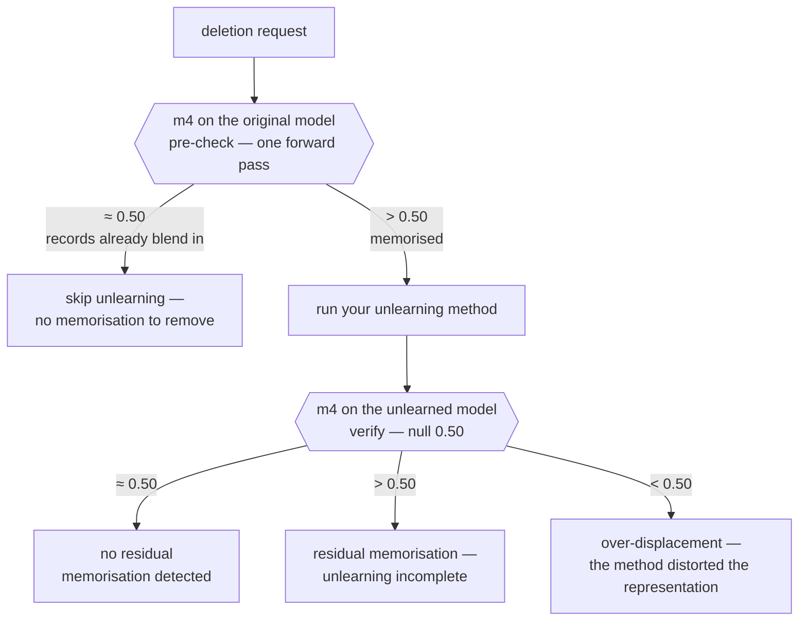
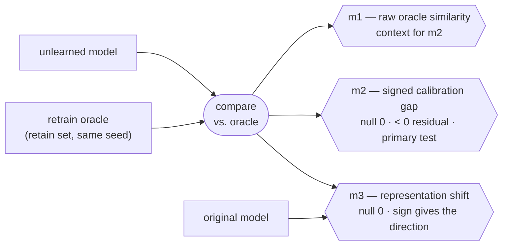

# RULER: Representation-Level Verification of Machine Unlearning

[](https://www.python.org)
[](LICENSE)
[](https://arxiv.org/abs/2605.27569)
[](https://aiimlab.org/events/ECML_PKDD_2026_WIPE-OUT_2_Workshop_on_Machine_Unlearning_and_Privacy_Preservation)

**Is there anything to unlearn in the first place?** When a record was never
memorised, unlearning has nothing to remove and can distort the representation
instead, so this is the check that comes before any method runs. Run `m4` on
your model to see whether the forget records still stand out from the retained
data — whether unlearning is needed at all. Run `m4` again afterwards to check
whether any memorisation remains. Both answers sit in the model's internal
representations, one layer beneath the predictions that output-level checks
read.

You supply penultimate-layer embeddings from your own experiment — from any
unlearning method, produced by any framework. The library reads the arrays and
returns four metrics, each with a null value to compare it against. Its only
dependency is NumPy.

**Start with the [tutorial](tutorial/)** — one complete verification on a small
dataset, with every printed output shown. It runs in under a minute on a laptop
CPU.

By [Georgina Cosma](https://www.lboro.ac.uk/departments/compsci/staff/georgina-cosma/)
(Loughborough University) and Axel Finke (Newcastle University); the metrics
are introduced in *RULER: Representation-Level Verification of Machine
Unlearning* (WIPE-OUT @ ECML PKDD 2026 — [citation](#citation)).

## Installation

```bash
pip install git+https://github.com/gcosma/RULER.git
```

## Using the library

Extract penultimate-layer embeddings from your models, pass them to a metric
function, and compare the result with its null value. `m4` uses the unlearned
model on its own:

```python
import numpy as np
from ruler import m4

rng = np.random.RandomState(0)
retain = rng.randn(1000, 64)

m4(retain[:50] + 1e-6, retain)      # 1.000: residual memorisation
m4(rng.randn(50, 64), retain)       # 0.515: forget records match the retain distribution
```

`m1`, `m2`, and `m3` compare the unlearned model against a retrain oracle, and
`all_metrics(...)` returns all four in one call. The [tutorial](tutorial/)
works through the full sequence on a real dataset.

## The four metrics

Every function takes `(n, p)` arrays of **penultimate-layer embeddings**: the
activation immediately before the task-specific output head. For a model
`f(x) = g(h(x))` with output head `g`, the metrics are computed on `h(x)`.

| Metric | Question | Inputs required | Null value | Interpretation |
|---|---|---|---|---|
| `m4` | Are the forgotten records still distinguishable from the retained ones? | a single model, no oracle | 0.50 | > 0.50 residual memorisation; < 0.50 over-displacement |
| `m2` | Are they where a model retrained without them would place them? | + retrain oracle | 0 | < 0 residual memorisation; > 0 over-correction |
| `m3` | Did unlearning move them towards the oracle? | + retrain oracle + original model | 0 | sign gives the direction of movement |
| `m1` | Raw similarity to the oracle | + retrain oracle | — | context only; `m2` is its calibrated form |

`all_metrics(...)` computes all four in one call; `cosine_similarity(a, b)`
is the row-wise primitive they are built on.

## Which metric, when

`m2` (supported by `m1` and `m3`) **tests an unlearning method** once, against
a retrain oracle. `m4` reads a single model's own geometry, so it serves each
deletion request twice: run it **before** unlearning to check whether the
records were memorised at all — that is, whether unlearning is needed — and
**after** unlearning to check whether any memorisation remains. Each run is one
forward pass on one model.

**Per deletion request — `m4`, no oracle:**



**Method evaluation — `m1`, `m2`, `m3`, with the oracle, once:**



## Obtaining the embeddings

Take the activation immediately before the task-specific head:

| Architecture | Penultimate layer |
|---|---|
| MLP | last hidden activation |
| Small CNN | last fully-connected layer before the classifier |
| ResNet-18 | the 512-dimensional activation after global average pooling |
| BERT-family | the `[CLS]` vector from the final transformer layer |

```python
model.eval()                                        # required; see condition 1 below
with torch.no_grad():
    # ResNet-style: everything up to the classifier
    backbone = torch.nn.Sequential(*list(model.children())[:-1])
    embeddings = backbone(x).flatten(1).cpu().numpy()

    # BERT-style
    embeddings = model.bert(**batch).last_hidden_state[:, 0, :].cpu().numpy()
```

## Conditions for valid results

The library checks what the arrays reveal — shape, alignment, NaN, inf, and
norm overflow or underflow — and raises an error that names the cause. Four
further conditions sit outside the arrays. The library reads only the numbers
you pass it, so a broken condition produces a wrong number that still looks
valid. Confirm each one yourself (the [tutorial](tutorial/) shows the first two
in action):

1. **Set `model.eval()` before extracting embeddings.** Dropout or batch
   normalisation left active makes the same record embed differently on each
   call.
2. **Use the same records, in the same order, across models.** `m2` compares
   retain rows one-to-one, so reordering one side silently changes its sign.
3. **Pair the seeds for `m1`, `m2`, and `m3`.** Train the original model and
   the oracle from the same random initialisation, so the metrics measure
   unlearning rather than initialisation geometry.
4. **Keep each erasure request whole.** Send every record of one patient,
   document, or identity entirely to the forget set or entirely to the retain
   set.

On small forget sets, read `m4` against its sampling noise: its standard
deviation under the null is `1/sqrt(12n)`, so with 10 records any value within
0.50 ± 0.18 is consistent with the null (± 0.10 at n = 33, ± 0.05 at n = 129,
± 0.02 at n = 801).

## Testing

```bash
pytest
```

The suite checks each metric against its defining equation, confirms that
malformed input is refused, and runs the tutorial's code blocks, so the
outputs shown there stay accurate.

## The checkpoints

`checkpoints/` holds the 400 pre-trained models from the paper's experiments
(10 tabular datasets × 10 training seeds × {original, oracle at 1%, 5% and
10% forget fractions}). The library runs without them; they are provided for
reproducing the paper.

## Citation

```bibtex
@inproceedings{cosma2026ruler,
  title     = {{RULER}: Representation-Level Verification of Machine Unlearning},
  author    = {Cosma, Georgina and Finke, Axel},
  booktitle = {2nd Workshop on Machine Unlearning and Privacy Preservation
               ({WIPE-OUT}), co-located with the European Conference on Machine
               Learning and Principles and Practice of Knowledge Discovery in
               Databases ({ECML} {PKDD})},
  address   = {Naples, Italy},
  year      = {2026},
  eprint    = {2605.27569},
  archivePrefix = {arXiv},
  primaryClass  = {cs.LG},
  note      = {Revised version to appear in Springer Communications in Computer
               and Information Science (CCIS)}
}
```

## License

MIT — see [LICENSE](LICENSE).
