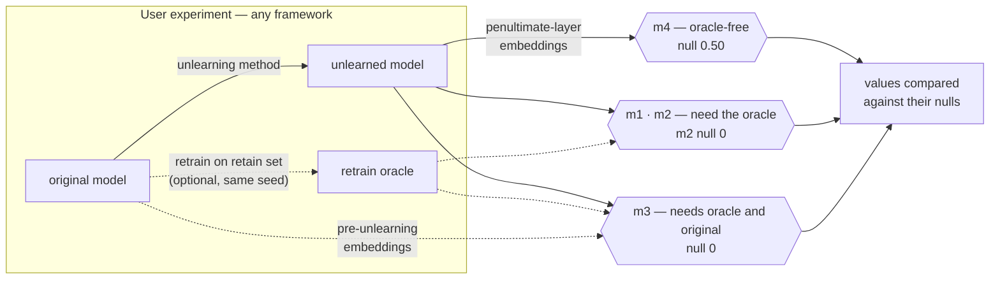

# RULER: Representation-Level Verification of Machine Unlearning

[](https://www.python.org)
[](LICENSE)
[](https://aiimlab.org/events/ECML_PKDD_2026_WIPE-OUT_2_Workshop_on_Machine_Unlearning_and_Privacy_Preservation)

Code for *RULER: Representation-Level Verification of Machine Unlearning* by
**Georgina Cosma** (Loughborough University) and **Axel Finke** (Newcastle
University), accepted at the
[2nd Workshop on Machine Unlearning and Privacy Preservation (WIPE-OUT)](https://aiimlab.org/events/ECML_PKDD_2026_WIPE-OUT_2_Workshop_on_Machine_Unlearning_and_Privacy_Preservation),
ECML PKDD 2026, Naples.

Documentation: [Tutorial](docs/tutorial.md) ·
[User manual](docs/manual.md) ·
[Choosing inputs](docs/choosing-inputs.md) ·
[Reproducing the paper](#reproducing-the-paper)

## Overview

Machine unlearning is commonly evaluated at the output level: forget-set
accuracy compared with a retrained model, preserved retain-set accuracy, and
membership-inference attack success near chance. These checks assess
predictions, not the representations that produce them. A model can satisfy
all of them while its intermediate layers still encode the forgotten records
in ways that differ measurably from a model that never trained on them. In
the paper, four approximate unlearning methods pass the standard output-level
checks, while the M2 metric detects statistically significant
representation-level residuals in 10 of 12 conditions.

The `ruler` library computes four representation-level metrics from
penultimate-layer embeddings. It contains no training or unlearning code:
you run your experiment in any framework and pass the embeddings as arrays.



## Installation

```bash
pip install ruler-unlearning
```

The library depends only on NumPy. It works alongside PyTorch, JAX,
TensorFlow or scikit-learn without importing any of them; which framework
produced the embeddings is irrelevant to the library.

## Usage

```python
import numpy as np
from ruler import m4

rng = np.random.RandomState(0)
retain = rng.randn(1000, 64)

m4(retain[:50] + 1e-6, retain)      # 1.000: residual memorisation
m4(rng.randn(50, 64), retain)       # 0.515: forget records blend into the retain distribution
```

A value of 1.000 indicates residual memorisation; a value near 0.50
indicates the forget records are indistinguishable from the
retained records. The [tutorial](docs/tutorial.md) develops these examples into a
complete experiment, with every printed output shown.

## The four metrics

Every function takes `(n, p)` arrays of **penultimate-layer embeddings**: the
activation immediately before the task-specific output head. For a model
`f(x) = g(h(x))` with output head `g`, the metrics are computed on `h(x)`.

| Metric | Question | Inputs required | Null value | Interpretation |
|---|---|---|---|---|
| `m4` | Are the forgotten records still distinguishable from the retained ones? | unlearned model only | 0.50 | > 0.50 residual memorisation; < 0.50 over-displacement |
| `m2` | Are they where a model retrained without them would place them? | + retrain oracle | 0 | < 0 residual memorisation; > 0 over-correction |
| `m3` | Did unlearning move them towards the oracle? | + original model | 0 | sign gives the direction of movement |
| `m1` | Raw similarity to the oracle | + retrain oracle | — | context only; `m2` is its calibrated form |

### M4: oracle-free percentile rank

For each forget record, M4 takes its cosine similarity to the nearest retain
record and ranks that value within the retain records' own leave-one-out
nearest-neighbour similarities. A record that is indistinguishable from the
retain set ranks at the median, giving 0.50. M4 requires no oracle and no
retraining; it needs only embeddings from the unlearned model.

```python
m4(embed(unlearned, forget), embed(unlearned, retain))
```

M4 can also be computed on the original model, before unlearning. A value
near 0.50 there indicates the forget records were never memorised, in which
case there is nothing for unlearning to remove. In the paper's experiments,
one method reduced a pre-unlearning value of 0.50 to 0.16, introducing a
representational artefact rather than removing memorisation.

### M2: signed calibration gap (the paper's primary metric)

M2 is the mean similarity of forget records to the retrain oracle, minus the
median similarity that retain records achieve between the same two models.
The retain-side baseline calibrates away every source of difference except
the effect of unlearning itself. A negative value means the forgotten
records sit further from the oracle than retained records do: residual
memorisation.

```python
m2(embed(unlearned, forget), embed(oracle, forget),
   embed(unlearned, retain), embed(oracle, retain))
```

M2 requires a retrain oracle: a model trained from scratch on the retain set
alone, from the same initialisation seed as the original model. See
[building an oracle](docs/manual.md#5-building-a-retrain-oracle).

### M3, M1, and all four at once

```python
from ruler import all_metrics

scores = all_metrics(u_forget, u_retain, o_forget, o_retain, orig_forget)
# {'m1': 0.961, 'm2': -0.035, 'm3': 0.002, 'm4': 0.486}
```

`m3` is returned as `None` when the original model's embeddings are not
supplied, rather than a fabricated zero.

## Obtaining the embeddings

Extracting embeddings is the one step the library leaves to the caller,
since it depends on the architecture. The rule: take the activation
immediately before the task-specific head.

| Architecture | Penultimate layer | Dim |
|---|---|---|
| MLP | last hidden activation | — |
| Residual MLP / FT-Transformer | final hidden layer | 128 |
| Small CNN | last fully-connected layer before the classifier | 256 |
| ResNet-18 | post-global-average-pooling activation (not the last convolutional block) | 512 |
| BERT-family | `[CLS]` output of the final transformer layer (not the LM head) | 768 |

```python
model.eval()                                        # required; see condition 1 below
with torch.no_grad():
    # ResNet-style: everything up to the classifier
    backbone = torch.nn.Sequential(*list(model.children())[:-1])
    embeddings = backbone(x).flatten(1).cpu().numpy()

    # BERT-style
    embeddings = model.bert(**batch).last_hidden_state[:, 0, :].cpu().numpy()
```

## Conditions for valid results

The library validates what it can from the arrays themselves — shapes,
alignment, NaN/inf, norm overflow and underflow — and raises an error naming
the cause.
The following four conditions cannot be detected from the arrays; violating
any of them produces incorrect metric values without an error.

1. **Call `model.eval()` before extracting embeddings.** Active dropout or
   batch normalisation makes the same record embed differently on every
   call. Demonstrated in the
   [tutorial](docs/tutorial.md#part-7--the-two-silent-failure-modes-demonstrated).
2. **Use the same records, in the same order, across models.** `m2` compares
   retain rows one-to-one; reordering one copy changes its sign without any
   error. Also demonstrated in the tutorial.
3. **Use paired seeds for `m1`, `m2` and `m3`.** Cosine similarity is not
   rotation-invariant. The original model and the oracle must be trained
   from the same random initialisation: same-seed pairs reach approximately
   0.99 cross-model similarity, differently-seeded pairs approximately 0.44
   (Appendix A.16). With an unpaired oracle the metrics measure
   initialisation geometry, not unlearning.
4. **Do not split an erasure request.** All records belonging to one patient,
   document or identity must be assigned wholly to the forget set or wholly
   to the retain set; otherwise `m4` measures the split rather than the
   model.

## Interpreting M4 on small forget sets

M4 is a mean over forget records. Under the null hypothesis each record
contributes a uniform value, so the standard deviation of M4 is
`1/sqrt(12n)`. On a small forget set, values well away from 0.50 are
consistent with no memorisation at all:

| Forget records | 95% interval under the null |
|---:|---|
| 10 | 0.50 ± 0.18 |
| 33 | 0.50 ± 0.10 |
| 129 | 0.50 ± 0.05 |
| 801 | 0.50 ± 0.02 |

An individual erasure request typically involves tens of records, which is
below the metric's resolution. In that regime, aggregate several requests,
or frame the question at the model level rather than per deletion.

## Reproducing the paper

The paper's experiments are in [`paper/`](paper/), separate from the
library: the ten tabular datasets, the MLP of Fig. 2, five unlearning
methods, the mixed-effects analysis, and every table and figure.
`checkpoints/` contains the 400 pre-trained models (10 datasets × 10 seeds ×
{original, oracle at 1%, 5%, 10%}), so the experiments run without
retraining.

```bash
git clone https://github.com/gcosma/RULER.git
cd RULER
pip install -e '.[paper]'

python experiments/run_primary.py --output results/primary.csv
python experiments/analyse.py results/primary.csv --outdir results/tables
python experiments/figures.py results/primary.csv --outdir figures
```

| Paper result | Command |
|---|---|
| Tables 1, 3, 4 (§5.1–5.2) | `run_primary.py` → `analyse.py` |
| Bad Teacher (§5.4, A.11) | `run_primary.py --methods "Bad Teacher"` |
| M2 between independently retrained oracles, Fig. 5 (A.5) | `run_oracle_calibration.py` |
| Mini-batch robustness (A.6) | `run_primary.py --batch-size 128 --checkpoint-dir checkpoints_minibatch` |
| Learning-rate sensitivity (A.7) | `run_primary.py --unlearn-lr 1e-4 --forget-fractions 0.05` |
| Forget-set sampling (A.8) | `run_primary.py --forget-seed 1000 --checkpoint-dir checkpoints_fs1000` |
| Clinical text, Fig. 4 (§5.5) | [`notebooks/ruler_clinical_text.ipynb`](notebooks/ruler_clinical_text.ipynb) |

## Testing

The test suite contains 121 tests and runs without network access or a GPU:

```bash
pytest
```

What the suite verifies:

- Each metric is checked against its defining equation from the paper,
  including exact-tie and chunk-boundary cases.
- The shipped checkpoints reproduce the paper's paired-seed result
  (Appendix A.16: approximately 0.99 same-seed versus 0.44 cross-seed
  similarity).
- The published forget-set sizes (Appendix Table 9) are reproduced for all
  ten datasets.
- Every code block in the tutorial and the manual is executed by the test
  suite, and every printed output in the tutorial matches real execution.
- Malformed input — NaN, inf, overflow- or underflow-scale magnitudes,
  misaligned or empty arrays — is rejected with an error naming the cause.

## Repository structure

```
ruler/          the library: four metrics, one module, NumPy only
paper/          the paper's experiment code; imports ruler
experiments/    command-line runners for every table and figure
notebooks/      clinical-text experiment (§5.5)
docs/           tutorial, user manual, guidance on choosing inputs
checkpoints/    400 pre-trained models
tests/          121 tests, including the documentation
```

## Citation

```bibtex
@inproceedings{cosma2026ruler,
  title     = {{RULER}: Representation-Level Verification of Machine Unlearning},
  author    = {Cosma, Georgina and Finke, Axel},
  booktitle = {2nd Workshop on Machine Unlearning and Privacy Preservation
               ({WIPE-OUT}), co-located with the European Conference on Machine
               Learning and Principles and Practice of Knowledge Discovery in
               Databases ({ECML} {PKDD})},
  address   = {Naples, Italy},
  year      = {2026},
  note      = {Revised version to appear in Springer Communications in Computer
               and Information Science (CCIS)}
}
```

## License

MIT — see [LICENSE](LICENSE).
